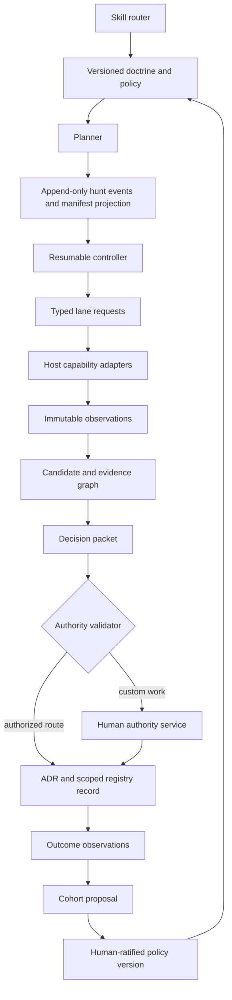
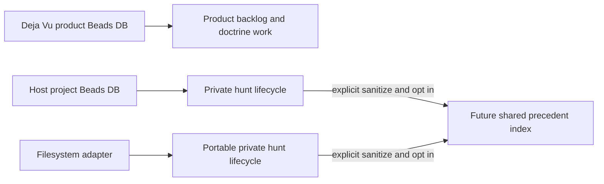

# Deja Vu v2 architecture

> A protocol-first prior-art engine that helps agents determine what already
> exists before they authorize custom work.

**Status:** P1 target architecture candidate under adversarial review  
**Version:** 2.0  
**Date:** 2026-08-31  
**Owner:** Vishnu Jayavel

This document is the canonical architecture specification for Deja Vu P1. It
defines the system boundary, lifecycle, authority model, and quality gates.
`SKILL.md` routes agents into this protocol. Reference guides explain
individual stages. P1 will add executable schemas and tests that enforce the
contracts.

The repository currently implements part of this design. Unless a statement is
inside the migration baseline, it specifies the P1 target and does not claim
shipped behavior. Beads records implementation status; this document records
architecture. The migration table identifies the current baseline and required
transition.

When artifacts disagree, precedence is:

1. ratified architecture and authority decisions;
2. version-compatible executable schemas and policy;
3. executable conformance tests;
4. the skill router;
5. explanatory references and examples.

Every manifest records the architecture, schema, and policy versions. An
unsupported or incompatible combination fails closed. A lower-precedence
artifact cannot silently override a higher-precedence contract.

## 1. Outcome and scope

Deja Vu turns a proposed build into a reproducible prior-art decision. A fresh
agent must be able to answer five questions without reconstructing a transcript:

1. What problem are we deciding?
2. Which search obligations are complete, degraded, or unsupported?
3. What evidence supports or contradicts each candidate?
4. Which reuse route is permitted, and which custom portions require human
   authority?
5. What is the next safe action?

P1 covers external prior art: repositories, packages, services, standards,
research, agent skills, architectural patterns, and documented null solutions.
P1 also covers durable hunt state, revalidation, outcome observations, bounded
learning proposals, and Claude and Codex adapters.

P1 does not cover repository-wide discovery of code already implemented inside
the consuming codebase. That problem has different precision, privacy, context,
and false-confidence risks. It remains isolated in the `deja-vu-p2` epic.

P1 also does not create a central database of private hunts. Cross-project
promotion is a later, opt-in capability that requires validated sanitization and
privacy contracts.

## 2. Design principles

### 2.1 The protocol is the product

Deja Vu is not a collection of search commands. It is a protocol: versioned data
contracts plus legal state transitions. Hosts may execute the protocol with
different tools, but they must preserve its evidence and authority semantics.

### 2.2 Observations are immutable; conclusions are derived

Search results, commands, timestamps, tool limitations, probe outputs, and human
approvals are observations. They are appended or superseded, never silently
rewritten. Candidate comparisons, recommendations, and current status are
derived views that identify the observations and policy version used.

### 2.3 Absence requires proven coverage

An empty result is evidence of absence only when the lane reports successful,
applicable coverage for the declared query. `degraded`, `failed`, `skipped`,
and `unsupported` are distinct states. A required lane in one of those states
adds uncertainty or requires an explicit override; it never becomes an empty
success.

### 2.4 Decisions are compositional

A single verdict string cannot represent real work such as “depend on a library
and build a small adapter.” Deja Vu records independent dimensions and then
renders a concise human summary. Every custom component retains its own authority
requirement.

### 2.5 Durable memory stays with its owner

The Deja Vu repository stores product development work. A consuming project
stores its own hunts. Portable skill code and public examples do not absorb
private project history. Beads is an optional durability adapter, not a runtime
requirement.

### 2.6 Learning proposes; humans ratify

Outcome observations may produce a doctrine-change proposal. They cannot modify
active policy. Policy activation requires a named human decision, held-out
behavioral evaluation, a version transition, and a rollback pointer.

### 2.7 Resource use is declared and bounded

Every hunt records its tier, capability map, request budget, time budget, and
stopping rules before external work begins. Deterministic collection handles
repeatable work. Agent judgment is reserved for framing, evidence interpretation,
probing, and authority decisions.

## 3. Abstraction tower



Each layer has one job:

| Layer | Responsibility | Must not do |
|---|---|---|
| Router | Detect applicability and load the next required contract | Reimplement the workflow in prose |
| Doctrine and policy | Define obligations, authority rules, budgets, and compatibility | Inspect host state or execute tools |
| Planner | Apply one policy version to framing and capabilities | Mutate policy or execute host tools |
| Event store and projection | Append facts and derive one revisioned manifest view | Decide what the facts mean |
| Controller | Validate transitions and return the next safe action | Persist through an adapter implicitly |
| Capability adapters | Execute requested observations on a host | Change decision or authority semantics |
| Evidence graph | Preserve identity, provenance, support, and contradiction | Collapse evidence into a global score |
| Decision engine | Derive route components, uncertainty, and recommendation | Issue human authority |
| Authority service and validator | Capture a deliberate human act and validate its scope | Invent a decision or modify evidence |
| Review adjudicator | Classify reviewer findings against the ratified module contract | Execute reviews, mutate implementation, or validate transitions |
| Durability | Store and resume project-owned state | Centralize private hunts |
| Learning | Describe outcomes and propose bounded changes | Edit active policy automatically |

Dependencies point downward through these interfaces. Policy does not import
adapters. The decision engine consumes canonical observations, not storage or
host objects. Durability adapters persist protocol records but cannot interpret
them. Host adapters transport human prompts and responses but cannot mint or
validate authority receipts.

## 4. Canonical lifecycle

The hunt state machine is intentionally small but represents every state that
changes the next safe action. Lane and candidate states remain in their own
records.

```text
draft
  -> planned
  -> discovering
  -> evaluating
  -> awaiting_authority | decided | declined | deferred
  -> decided | declined | deferred
  -> recorded
  -> observed
  -> superseded

active state -> blocked | cancelled | failed
blocked -> planned | discovering | evaluating | awaiting_authority | deferred
deferred -> evaluating | awaiting_authority | recorded
recorded | observed -> revalidation_planned
revalidation_planned -> recorded | observed
cancelled | failed -> successor hunt only
```

The state enum is `draft`, `planned`, `discovering`, `evaluating`,
`awaiting_authority`, `decided`, `declined`, `deferred`, `recorded`,
`observed`, `revalidation_planned`, `superseded`, `blocked`, `cancelled`, and
`failed`. The diagram and transition table are exhaustive: no adapter may add a
state or edge. `blocked` records exactly one recovery target from `planned`,
`discovering`, `evaluating`, `awaiting_authority`, or `deferred`. Retryable
conditions use `blocked`; `failed` is irrecoverable and terminal.

| Transition | Required evidence |
|---|---|
| `draft -> planned` | Solution-free problem, vocabularies, exclusions, tier rationale, policy version, capability map, and budgets |
| `planned -> discovering` | Required lane requests materialized with stable IDs |
| `discovering -> evaluating` | Every required obligation is either a proven `succeeded` observation or has an uncertainty record that names its non-success status, lost coverage, effect on candidate exclusions, and required authority escalation |
| `evaluating -> awaiting_authority` | Decision packet contains a custom component or another policy-controlled route |
| `evaluating -> decided` | Decision packet validates and requires no additional authority |
| `awaiting_authority -> decided` | Every component selected for execution has valid authority; rejected or deferred components are explicitly excluded from the executable route while remaining in the packet as evidence |
| `awaiting_authority -> declined|deferred` | The response identifies the controlled components and packet hash; deferred responses include a wake condition or expiry |
| `evaluating -> declined` | The need or every feasible route is explicitly rejected with evidence |
| `evaluating -> deferred` | The decision packet identifies the controlled components requiring deferral, and the response records a wake condition or expiry |
| `decided|declined|deferred -> recorded` | Human ADR and machine registry record generated from the same terminal packet |
| `recorded -> observed` | At least one provenance-bearing outcome observation appended |
| `deferred -> awaiting_authority|evaluating` | The wake condition occurs or a deliberate override records why replanning is safe |
| `blocked -> recorded recovery target` | Reconciliation closes every indeterminate attempt and a compare-and-swap event names one allowed recovery target |
| `recorded|observed -> revalidation_planned` | A stable revalidation request ID, staleness policy or explicit request, and bounded refresh obligations are recorded |
| `revalidation_planned -> recorded|observed` | One atomic create-and-link event idempotently creates or finds exactly one successor hunt for the request ID, then preserves the prior terminal state while the successor runs |
| `recorded|observed -> superseded` | A recorded successor decision identifies the prior run and explains the evidence, policy, and recommendation delta |
| `* -> blocked|cancelled|failed` | A reason, actor, recoverability classification, and next safe action are recorded |

`declined` means no executable route was accepted. A mixed packet instead reaches
`decided` with an explicit executable component set; rejected or deferred
components remain visible but cannot be executed. `cancelled` and irrecoverable
`failed` runs are terminal. A recorded deferral also remains historical; a later
wake creates a linked successor. Restarting any terminal run creates a linked
successor rather than rewriting its history.

Non-success lane states never satisfy an evidence obligation by themselves.
`failed`, `skipped`, `unsupported`, and `degraded` remain attached to the
decision packet through uncertainty records. Policy determines whether their
coverage loss prohibits a decision, raises authority, or permits a qualified
decision. A summary renderer cannot hide those qualifications.

The append-only event log is the durable source of truth. The manifest is a
projection with `revision` and `last_event_id`. Every controller write uses
compare-and-swap against the observed revision. An external attempt has a stable
attempt ID and semantic idempotency key before execution; budget reservation,
attempt start, receipt capture, and completion are separate events. Deja Vu
guarantees local event idempotency, not provider exactly-once behavior. A crash
after dispatch creates `indeterminate-effect`. Recovery may retry only when the
provider accepts the same idempotency key or a status query proves no effect
occurred; otherwise it blocks for reconciliation or explicit human authority. A
successful observation reruns only under staleness policy or explicit override.

## 5. Core contracts

All machine contracts are versioned and validate before persistence. Human prose
may summarize them but cannot replace them.

Executable schemas define required fields, types, cardinality, formats, unknown
field behavior, and referential integrity. Canonical JSON uses RFC 8785 JSON
Canonicalization Scheme after schema validation rejects duplicate object keys
and non-finite numbers. Strings must already be Unicode NFC; validators reject
rather than silently normalize them. Protocol timestamps use RFC 3339 UTC with
exactly three fractional digits. Contract text hashes are the explicitly defined
exception: they cover exact UTF-8 bytes so any contract edit invalidates prior
review. IDs are namespaced, immutable, and derived from declared
identities or generated before effects; aliases never replace canonical IDs.
Schema evolution is additive within a compatible major version. A breaking
change requires migration code, fixture coverage, and an architecture-version
transition.

### 5.1 Hunt events and manifest

The append-only hunt event stream is the durable source of truth for one decision
problem. The manifest is a deterministic projection of those events. It contains:

- stable hunt and project identities;
- architecture, event-schema, projection-schema, and policy versions;
- projection revision, last event ID, last event digest, and prior manifest hash;
- tier rationale, capability map, budgets, and stopping rules;
- lane requests and their current terminal or non-terminal state;
- canonical candidate and evidence references;
- unresolved uncertainty and override receipts;
- decision-packet, authority, record, and supersession references;
- active attempt IDs, idempotency keys, leases, and budget reservations;
- created, observed, reviewed, and stale-after timestamps.

Each event has a canonical ID, stream sequence, prior-event digest, event digest,
actor, timestamp, expected manifest revision, and payload schema. The event
digest covers the canonical event excluding its own digest field. The first
event references the declared empty-stream digest. Unknown event types or fields fail closed unless the schema
explicitly permits forward-compatible extensions. Writers append with
compare-and-swap; projections are reproducible from events.

The event chain protects against accidental corruption, partial writes, and
concurrent writers; it does not make a hostile project owner unable to rewrite
local history. P1 states that threat boundary explicitly. Release checkpoints
may anchor the stream head in a protected, signed external verifier, and all
policy activation still requires authority-service signatures, so rewritten
local events alone cannot activate policy or certify a release.

Receipts and observations use content-addressed storage. A reference records digest algorithm,
digest, media type, byte length, origin, retrieval time, retention class, and a
minimum immutable excerpt or normalized fact set needed to audit the claim.
Garbage collection cannot remove a receipt referenced by any retained event,
observation, decision, or supersession record. P1 does not compact receipts.
Future compaction requires a tombstone event carrying the complete normalized
audit payload and its prior digest. Integrity validation is part of resume and
release checks.

### 5.2 Lane envelope

Every discovery, enrichment, or probe lane returns the same outer contract:

```text
lane_id, phase, adapter, request, queries, applicability,
obligation_refs, coverage_proof, status, observations, candidate_refs,
limitations, cost_events, attempt_id, idempotency_key,
started_at, finished_at, retry_guidance, errors
```

Allowed statuses are `pending`, `running`, `succeeded`, `degraded`,
`failed`, `skipped`, and `unsupported`. Only `succeeded` may support a
claim of no results, and only within the recorded coverage.

A coverage proof is typed. It identifies the obligation and query, index or data
source, scope and revision, filters, pagination cursors, pages and result count,
provider result cap, truncation signal, rate-limit state, collection time, and
adapter version. `succeeded` requires exhaustion of the declared bounded scope
and no unreported cap or truncation. Partial pagination, unknown caps, rate
limits, stale indexes, and lossy fallbacks produce `degraded`.

Lane phases are distinct:

- **Discovery** finds candidates without seeing another lane's results.
- **Shortlist enrichment** inspects known candidates and may use the merged
  shortlist.
- **Probe** runs bounded hands-on checks against one candidate.

Calling every activity a blind parallel lane is incorrect. Only independent
discovery requests cross the blind barrier together.

### 5.3 Evidence graph

A candidate has a canonical identity and aliases. Typed edges connect candidates
to observations about:

- claimed problem and actual behavior;
- repository, package, service, standard, paper, pattern, or null-solution kind;
- versions, releases, and source revisions;
- license and policy constraints;
- health and provenance signals;
- test and probe behavior;
- dependencies, forks, inspirations, and alternatives;
- supporting, contradicting, stale, and superseding evidence.

Every observation ID resolves to either an inline canonical payload with its
digest or a content-addressed receipt reference. The graph preserves
disagreement. A later observation may contradict an earlier one; it does not
overwrite it. Derived comparisons cite observation IDs and their digests.

### 5.4 Decision packet

The proposed packet has a canonical serialization, packet ID, and
`approval_material_sha256`. That digest covers its problem disposition,
candidate comparisons, uncertainty, reversibility, and ordered route components,
but excludes authority decisions and receipt references. Those fields cannot
therefore create a circular hash. After authority resolution, an authorized
decision record references the immutable proposed packet, authority receipts,
and exact executable component set and has its own `decision_record_sha256`.
The proposed packet records an ordered `route_components` array. Every component
has a stable ID and contains:

- route and output boundary;
- candidate and evidence references;
- fit, rights, and evidence level;
- whether the component creates project-owned custom behavior;
- policy clauses and authority requirement;
- accepted obligations, residual uncertainty, and next action.

Dimensions are independent and apply at packet or component scope as defined by
their executable schema:

| Dimension | Representative values |
|---|---|
| Need disposition | `resolved`, `reframe`, `proceed`, `unknown` |
| Prior-art kind | repository, package, service, standard, research, pattern, skill, null solution |
| Candidate fit | `exact`, `composable`, `partial`, `mismatch`, `unverified`, `none` |
| Rights and policy | `permitted`, `conditional`, `prohibited`, `unknown` |
| Evidence level | `metadata`, `documented`, `source-inspected`, `probed`, `operational` |
| Reuse route | `depend`, `configure`, `fork`, `vendor-source`, `clean-room-reimplement`, `compose`, `custom-build`, `none` |
| Custom delta | explicit ownership, input/output boundary, and maintenance surface for one route component |
| Authority | `agent-authorized`, `human-required`, `approved`, `rejected`, `deferred`, per route component |

`vendor-source` and `clean-room-reimplement` are different routes. Source
without reuse rights may inform an idea, but it cannot be forked or vendored.
Clean-room reimplementation is custom behavior and therefore requires human
authority. `compose` is a packet structure, not an escape hatch: each composed
component retains its own route and authority.

Packet validation fails if a component has no stable ID, evidence, output
boundary, or authority state; if custom behavior is hidden in an agent-authorized
route; or if rights prohibit the selected route. A mixed packet can therefore
represent an approved dependency and a rejected, deferred, or approved custom
adapter without flattening their states.

### 5.5 Review record

Every executable or public-contract code module changed by P1 requires a
fresh-context Claude Fable 5 adversarial review record for the current artifact
hash. The reviewer receives the artifact and its contract, not the author's claim
or reasoning.

The record contains:

```text
module_path, artifact_sha256, contract_ref, contract_sha256,
governing_contract_sha256, reviewer, launch_envelope_sha256, permission_hash,
stdout_sha256, result_evidence_sha256, delegate_job_id, round, verdict,
findings, adjudication
```

SHA-256 is computed over exact file bytes. The contract digest uses its exact
UTF-8 text. A change to either digest makes the prior review stale; there is no
“substantive change” exception. The authoritative artifact-to-contract map lives
at `contracts/module-contracts.json`; the gate accepts no caller-selected
contract. A review also binds `governing_contract_sha256`, computed from the
canonical architecture digest, applicable policy digests, inventory-rule digest,
and decoded module-contract text. Any governing change invalidates every affected
review. The module inventory is generated by executable path rules and stored
with the checkpoint. It includes `docs/design.md`, `SKILL.md`, executable source
under governed directories, the eval runner, public JSON schemas, canonical
contract maps, and canonical policy artifacts. Exclusions are ratified policy
records, not reviewer discretion.

Contract text hashing always means SHA-256 over the UTF-8 bytes of the decoded
JSON string value—not the quoted JSON token and not re-encoded JSON. Conformance
fixtures cover escapes, newlines, Unicode NFC, and differently escaped JSON that
decodes to the same string.

`FIX-FIRST` blocks the implementing work item. After a change, a new round
reviews the new digests. Each finding is classified as contract misread,
actionable, accepted trade-off, or noise. A doubt cycle stops after a clean or
trivial round, three rounds, or explicit human override.

The review launcher is a trusted service boundary separate from repository
writers. It pins the reviewer model and target in the provider request. A
launcher-owned system prompt contains the reviewer policy; the candidate-owned
stdin contains only the bounded artifact-and-contract payload. The launcher
disables tools, MCP, session persistence, writes, undeclared network, and
unrelated ambient credentials, then records the actual invocation and result.
The prepared manifest includes the launcher's required ISO-8601 `created_at`
field. The preparer derives it from the sealed prompt's stable creation metadata
so preparing the same artifact, contract, and round again remains idempotent.
Its sealed directory and delegate job ID include both artifact and governing-
contract digest prefixes. A transitive architecture, policy, inventory-rule, or
module-contract change therefore creates a new identity instead of colliding
with—or reusing—the previous prompt.
Preparation returns two distinct commands: a deterministic `validate` command
that checks and hashes the manifest without creating or launching a job, and a
`submit` command that remains an external effect requiring explicit authority.
Agents run validation before requesting authority and never treat validation as
review evidence.
After terminal success, the protected gc-router `verify-review` operation loads
the authoritative job state by ID, derives the candidate root from the sealed
manifest, rechecks current artifact, contract, governing, prompt, launcher,
permission, model, target, system-prompt, and stdout bindings, and emits one
schema-compatible review record. It preserves raw `fix-first` output as
actionable, non-eligible findings; an agent never hand-assembles or relabels the
record.
Its durable evidence binds the trusted system-prompt digest, exact stdin digest,
provider and process identities, permission envelope, output digests, and
delegate job ID. The protected local verifier reads that evidence directly. If
evidence crosses a host or protection boundary, an authenticated envelope is
required. A reviewer-authored or candidate-copied claim is never sufficient.

A review round and a transport attempt are different identities. A review round
counts one completed reviewer judgment for fixed artifact and governing-contract
bytes. A transport attempt counts one launcher invocation within that round.
Preparation permits at most three transport attempts per round. Each attempt has
a distinct sealed path and Direct job ID, while the reviewer prompt bytes and
`review_round` field remain identical. Authentication, launch, timeout, or
provider failures do not produce a review record and do not consume a review
round. Retrying requires a new transport-attempt identity and fresh authorization
for the exact submit command; a failed job ID is never reused. Fresh authorization
is an operator and host-orchestrator control, not a claim encoded in the candidate
manifest. The Direct launcher validates the least-privilege envelope and unique
job lifecycle, but it cannot infer human intent from a replayed shell command.

A separate pinned verifier, outside the candidate repository and identified by
executable digest, owns the inventory bootstrap, launcher evidence adapter,
signature checks, and final release predicate. The repository checker reports
coverage diagnostics but always leaves `release_authorized` false; it cannot
certify itself. Beads stores review state and evidence references when available,
and the filesystem adapter stores the same schema. Neither adapter can mint the
verification result.

The verifier also reads the protected stdout bytes, recomputes their digest, and
parses exactly one strict review-result object. A candidate cannot relabel raw
`fix-first` output as a clean pass. Any adjudicated record preserves the raw
severity, summary, evidence, and contract clause before adding classification
and resolution.

Review adjudication is another authority-bearing record. It binds artifact,
governing-contract, finding, reviewer, and launch-attestation digests; preserves
the original text; and records each disposition. Closing an actionable finding
requires a changed artifact and fresh review. `contract-misread`, `noise`,
`accepted-trade-off`, and `human-override` dispositions require an asymmetric,
scoped authority-service signature from a configured review approver; accepted
trade-offs also record expiry or revalidation policy. Repository or durability
writers cannot mint these records.

## 6. Authority model

Authority applies to route components, not to a six-value summary label.

- A permitted, verified dependency or configuration route may proceed under
  agent authority.
- Forking and source vendoring require rights evidence and any project policy
  approvals.
- Clean-room reimplementation never inherits source-reuse authority merely
  because the idea is visible.
- Every custom component requires human approval tied to the proposed packet's
  `approval_material_sha256` unless the host project has a stricter policy.
- Missing or degraded required evidence cannot silently lower the authority
  threshold.

An authority receipt contains a stable receipt ID, authenticated human principal,
issuer and authentication method, project and hunt IDs, policy version,
`approval_material_sha256`, exact component IDs and component hashes, decision,
nonce, issued and expiry times, optional revocation reference, issuer key ID,
and asymmetric digital signature. The authority service is a protected boundary
whose signing keys are unavailable to protocol writers and adapters. Issuance
atomically consumes the challenge nonce in the authority service's replay
ledger. Validators receive only public keys and cannot mint approvals. The
validator rejects an unknown principal,
expired or revoked receipt, reused nonce, different project or hunt, stale packet
or component hash, omitted controlled component, and a receipt issued by an
adapter or reviewer.

A recovery-authority receipt is a separate type used before a decision packet
exists. It binds the prior attempt, provider effect, idempotency key, resource
identities, cost exposure, and one exact recovery action. It cannot authorize a
reuse route or custom component. Likewise, every controlled action requests a
short-lived execution grant immediately before its external effect. The grant
binds the authorized decision record and component; revocation or expiry denies
execution and requires a successor decision or new authority receipt. A
transition-time approval alone is never an execution permit.

Host adapters may transport a human prompt and raw response. They cannot declare
that response authoritative. The authority service creates the scoped receipt;
the deterministic validator decides whether it satisfies policy. Rejection and
deferral preserve the recommended packet as evidence but prohibit execution of
the affected components.

The human-readable receipt may still say “DEPEND,” “COMPOSE,” or “BUILD,” but the
typed components and authority receipts are the source of truth.

## 7. Tier, capability, and resource policy

P1 delivers one versioned policy matrix consumed by both documentation and code.
The matrix owns exact lane obligations and budgets. The architecture fixes these
rules:

1. A tier is selected from build cost, maintenance surface, reversibility, and
   evidence risk.
2. Every required observation names the capability it needs.
3. Host adapters report capabilities before planning; they do not invent silent
   fallbacks during execution.
4. A fallback either satisfies the same coverage contract or produces a degraded
   state.
5. Time, external requests, tokens, probes, and retained receipt size have
   explicit ceilings and durable units.
6. Stopping rules include sufficient verified fit, exhausted bounded coverage,
   budget exhaustion with uncertainty, and a required human decision.

Before an external effect, the controller reserves its worst-case declared cost
against a revisioned budget ledger. Completion debits observed cost and releases
the remainder. Failure and cancellation record whether the provider may still
have consumed the reservation. Unknown cost remains charged at the reservation
until reconciled. Retries use new attempt IDs but the same semantic idempotency
key. A provider with no idempotency or effect-status contract cannot be retried
automatically after an indeterminate dispatch.

Each lane request also fixes a hard deadline, maximum output bytes, retry count,
and hunt-wide concurrency slot. The adapter must acknowledge cancellation and
resource cleanup; otherwise the attempt remains indeterminate and its reservation
stays charged. The controller stops scheduling before a declared limit and never
uses budget accounting as a substitute for process enforcement.

A probe additionally records a lease, process and resource identities, sandbox
path, cleanup policy, and cleanup receipt. Recovery reaps only resources owned by
that attempt. An expired lease makes the hunt `blocked` until reconciliation;
it never triggers an unbounded duplicate probe.

The current names `Quick`, `Standard`, and `Full` may remain as user-facing
profiles. Their exact behavior must come from the canonical matrix, not duplicated
tables in multiple prose files.

## 8. Durability and database boundaries



### 8.1 Product database

This repository's existing Beads database is the dedicated database for Deja Vu
product development. It stores epics, decisions, implementation work, review
records, and durable project memories. It does not store unrelated projects'
runtime hunt evidence.

### 8.2 Host-project hunts

When the consuming project uses Beads, one decision problem maps to one primary
Bead. Detailed candidates and evidence live in a versioned artifact referenced by
that Bead. Additional Beads are created only for independent lifecycles such as a
probe, human gate, implementation, revalidation, or doctrine proposal.

Parent-child edges express hierarchy. `blocks` expresses a true prerequisite.
`discovered-from` records emergent work. Candidates do not each become issues.

Every hunt declares `visibility`: `local-only`, `project-sync`, or
`promotion-eligible`. The default is `local-only`. The Beads adapter uses an
unversioned/local storage class for local-only hunts and verifies that Dolt push
cannot include them. `project-sync` requires an explicit project policy and
means only that the owning project's authorized collaborators may receive the
record. It does not make the hunt eligible for cross-project promotion.

### 8.3 Filesystem fallback

Hosts without Beads store the same manifests, receipts, and decisions in
project-scoped, atomically written files. The adapter changes storage mechanics,
not schemas or decision semantics. It does not imitate issue tracking.

Local-only files live under a configured private state directory with directory
mode 0700 and file mode 0600. Setup adds and verifies a VCS ignore rule and
fails closed if a target path is already tracked or located outside the owning
project's approved state root. The adapter never performs remote writes.

### 8.4 Future shared index

A separate cross-project precedent database is not part of P1. P3 may propose it
only after promotion schemas, consent, sanitization, deletion, provenance, and
tenant boundaries are tested. Nothing is promoted by default.

## 9. Outcome learning

Self-improvement has three planes:

1. **Hunt evidence:** immutable observations and decisions.
2. **Outcome observations:** append-only facts about integration cost, reuse
   success, custom delta, abandonment, reversal, later discoveries, and missing
   follow-up.
3. **Policy:** a versioned, human-ratified interpretation of cohorts.

A P1 debrief uses outcomes owned by one project. Cross-project cohorts are out of
scope until P3 defines consented promotion. A debrief groups comparable outcomes
by route, ecosystem, stakes, and evidence level. It reports distributions,
counterexamples, and missingness. A doctrine proposal requires at least five
mature comparable hunts, an explicit counterexample search, provenance for every
row, and disclosure of selection gaps. Fewer observations may produce a question,
not a policy proposal.

Each proposal is project-local and bounded to named policy clauses. Its proposer
cannot approve it. Activation requires a scoped authority-service receipt signed
by a configured human policy approver; merely naming another actor is invalid.
The receipt binds proposal, old and new policy, fixture digests, result digest,
and rollback target, and the validator enforces proposer/approver separation.
Accepted policy changes run against a frozen historical set
and a separately selected held-out set before an atomic activation records the
approver, old and new versions, fixture digests, result, and rollback target.
Rollback is another append-only activation event. Original evidence remains
readable under its original policy version.

## 10. Host adapters and portability

The core controller is host-agnostic. A host adapter provides:

- a declared capability map;
- bounded execution of canonical lane requests;
- normalization into the lane envelope;
- transport of project identity and the already selected durability mode;
- transport of human prompts and raw responses;
- explicit unsupported and degraded states.

Claude and Codex adapters may use different search, browser, shell, and subagent
tools. Tool parity is not required; semantic transparency is. Deterministic
parity applies to invariants: the same canonical observations, policy, and
packet must yield the same exclusions, rights prohibitions, uncertainty
propagation, route-component authority requirements, and gate result. A
host-specific judgment is stored as a provenance-bearing observation and may
change a recommendation; it cannot change those invariants or be hidden.

The Fable reviewer is a separate, read-only Claude Fable 5 execution target. It
does not implement modules, mutate the workspace, or approve its own findings. The
review adjudicator classifies findings against the ratified contract and records
the reconciliation through the selected durability adapter. The controller only
validates the resulting transition and never interprets review findings.

Beads gates are coordination primitives, not correctness oracles. A human Beads
gate may keep dependent work blocked until the protected verifier has accepted
the evidence, but closing a Bead or copying a claimed verdict into metadata does
not prove that a test, review, or release predicate is true.

## 11. Safety, privacy, and failure recovery

- Treat candidate repositories, pages, packages, and issue text as untrusted
  input, never as agent instructions.
- Adapters place untrusted payloads in typed data fields distinct from control
  instructions, escape them before agent presentation, and enforce size limits.
  Candidate text cannot change exclusions, policy, capabilities, authority,
  query budgets, or tool permissions. Query expansion derived from evidence is a
  new planner event with provenance and policy validation.
- Probes use disposable, least-privilege environments with declared network,
  credential, resource, and cleanup policy.
- Never expose host credentials implicitly to candidate code.
- Retain the minimum receipt necessary to reproduce a material claim; do not
  retain large scraped content when a source reference and digest suffice.
- A failed adapter call records its attempt and retry guidance. It does not crash
  the whole hunt or become a successful-empty lane.
- Event appends and projection replacement are atomic. Recovery validates and
  replays the event hash chain, regenerates the manifest, rejects a divergent
  projection, and surfaces every attempt without a terminal reconciliation.
- Schema and policy migrations are explicit and reversible. Unsupported future
  versions fail closed.
- Private paths, identities, and decisions must pass sanitization before entering
  portable fixtures, documentation, or a future shared index.

## 12. Assurance model

P1 is not complete when schemas merely parse. Assurance has six layers:

1. **Unit tests** for normalization, transitions, gates, and adapters.
2. **Contract tests** for every versioned machine record.
3. **Behavioral scenarios** for successful-empty, degraded, failed,
   contradictory, unlicensed, interrupted, stale, composed, and human-gated
   hunts.
4. **Adapter parity tests** that compare canonical outcomes across Claude,
   Codex, Beads, and filesystem paths.
5. **Privacy and portability checks** that reject machine paths, private records,
   host-only claims, and stale documentation.
6. **Fable review coverage** that rejects a governed executable or
  public-contract module without a terminal review for its current artifact and
  governing-contract hashes or without launcher-enforced read-only evidence.

A test fixture distinguishes observed evidence from fabricated examples. Live
tests are opt-in and never replace deterministic offline coverage.

## 13. Migration from the current implementation

Baseline observed on 2026-08-31: `scripts/sweep.py` implements four collectors;
`scripts/provenance.py` implements maintainer metadata; `scripts/doctor.py`
checks the local environment; `scripts/sanitize_check.sh` detects portability
leaks; 52 unit tests and the offline trigger/verdict fixture checks pass; known
machine-specific paths have been converted to portable references, so the
sanitizer passes. The hardened review coverage and preparation tests bring the
current unit total to 78 passing tests.
There is no v2 manifest, controller, decision engine, durability adapter,
revalidation engine, or learning executor yet. Beads is the live completion
ledger for the work listed below.

| Current baseline | P1 transition | Owning Beads work |
|---|---|---|
| Prose router and conflicting tier tables | Thin router plus canonical policy matrix | `deja-vu-v2.3`, `.6`, `.7` |
| Four collectors with free-text errors | Typed envelopes with explicit coverage | `deja-vu-v2.9` |
| Transcript-held hunt state | Versioned manifest and resumable controller | `deja-vu-v2.8`, `.11` |
| Concatenated candidate records | Canonical identity and evidence graph | `deja-vu-v2.10` |
| Six overloaded verdict strings | Compositional decision packet and authority gate | `deja-vu-v2.2`, `.12` |
| Cross-project local registry | Scoped records under explicit database boundaries | `deja-vu-v2.4`, `.5`, `.15` |
| Manual, prose-only revalidation and learning | Delta revalidation, outcomes, cohort proposals, ratified policy | `deja-vu-v2.17`–`.20` |
| Claude-centric execution claims | Capability adapters with transparent degradation | `deja-vu-v2.22` |
| Schema-oriented evals | Behavioral and adapter-parity assurance | `deja-vu-v2.21` |
| No independent module review gate | Artifact-hash-bound Claude Fable 5 review | `deja-vu-v2.25` |

The v0.1 scripts and fixtures remain compatibility evidence until their behavior
is covered by v2 contracts. Migration must not silently reinterpret historical
registry records; compatibility readers preserve the original record and emit
explicit normalized views.

## 14. P1 release boundary

P1 delivers a two-stage deterministic checkpoint. Repository-owned
`scripts/release_check.py --json` produces a candidate report but cannot certify
itself. A pinned external verifier—identified by executable digest and protected
trust configuration—recomputes the inventory, reads launcher-owned evidence,
verifies authority signatures where required, validates the candidate report,
and emits the release eligibility record. Cross-boundary transport of that
record requires authentication; same-host protected-state verification does not
pretend that a candidate-owned signature adds trust. The report includes command,
exit status, artifact digest, and fixture count for:

- `python3 -m pytest -q`;
- `python3 evals/run_evals.py`, including the P1 end-to-end and adapter-parity
  fixture suites;
- `python3 scripts/doctor.py`;
- `bash scripts/sanitize_check.sh`;
- `python3 scripts/fable_review_gate.py --json` as a non-authoritative coverage
  diagnostic whose `release_authorized` field remains false;
- `bd lint` and `bd dep cycles`;
- schema, policy, architecture, router, and reference version compatibility;
- module inventory, receipt integrity, authority-replay rejection, and
  local-only storage leakage checks.

The candidate report also embeds typed acceptance-evidence records for every P1
child, the exact Beads database revision and issue/dependency digest, and the P2
and P3 dependency-state snapshot. The external verifier evaluates every closure
predicate against that one snapshot; mutable issue state outside it cannot
silently change the verdict.

The P1 end-to-end suite deterministically initializes, interrupts, resumes,
decides, declines or authorizes components, records, and revalidates the same
fixture through Beads and filesystem adapters. Live provider calls are not a
release dependency. A release may cite a frozen provider qualification valid at
the recorded release timestamp. Current operational readiness is a separate
doctor check: it may require a new opt-in live qualification after expiry, but it
cannot retroactively invalidate an artifact release.

The integration checkpoint `deja-vu-v2.24` may close only when:

- the pinned external verifier accepts the candidate report and returns a valid
  signed eligibility record;
- every direct P1 child is closed with acceptance evidence;
- the generated module inventory has exactly one selected terminal Fable review
  per governed current artifact and transitive governing-contract hash and no unresolved
  `FIX-FIRST` finding;
- the documentation-claim test proves every quickstart capability maps to an
  implemented capability and passing fixture;
- `deja-vu-p2` and `deja-vu-p3` still depend on this checkpoint and no P2 or
  P3 child is in progress.

The goal-driven human gate `deja-vu-z8u` blocks this checkpoint until the first
predicate above is demonstrated. It has no timer and must not be resolved from a
Beads status or local self-check alone.

## Appendix A: retained prior-art lineage

Deja Vu retains the strongest ideas from its v1 design: solution-free
re-probleming, pre-registered exclusion criteria, blind independent discovery,
backward and forward snowballing, hands-on probes, context-declared comparison,
license and maintainer provenance, asymmetric custom-work authority, ADRs, and
outcome-based learning.

Those ideas derive from prior work including Kitchenham and Charters' systematic
review guidance, Wohlin's snowballing method, QSOS, SEI PECA, OpenSSF Scorecard,
CHAOSS, Chesterton's Fence, Hyrum's Law, Choose Boring Technology, and ADR
practice. The original Deja Vu hunt also examined `build-vs-borrow`,
`github-prior-art`, `find-skills`, and RunX prior-art. Historical rationale
remains available through repository history and existing ADRs; this
specification changes the system structure and truth model, not that lineage.
