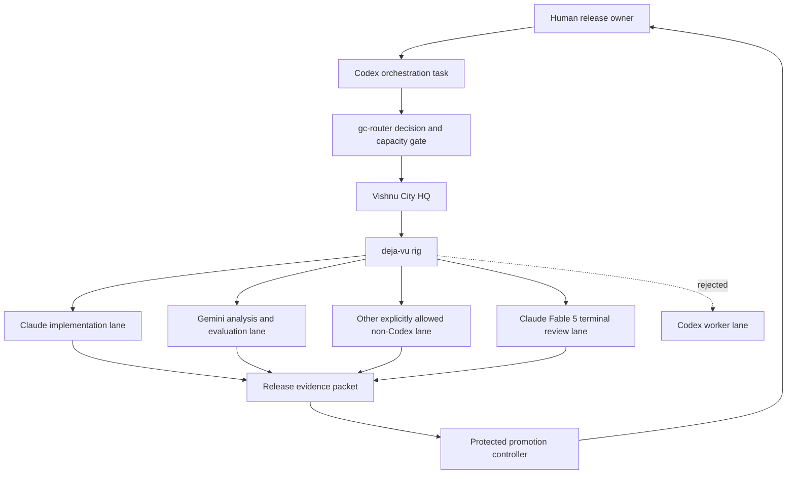

# Deja Vu release control in Vishnu City

**Status:** Approved

**Date:** 2026-09-01

**Primary mode:** Architecture explanation and implementation specification

**Tracking:** `deja-vu-p3.6`, `deja-vu-p3.6.1`

**Approved by:** Vishnu Jayavel on 2026-09-01

## Objective

Run Deja Vu's multi-step development and release workflows through Vishnu City
without sharing identity, work state, or model policy with the existing OSS
conductors. Deja Vu gets a dedicated `deja-vu` rig. The rig uses Claude for
implementation, Gemini and other explicitly allowed non-Codex models for
independent analysis, and Claude Fable 5 for the mandatory terminal adversarial
review of every changed executable module.

Success means an agent can determine the next safe action from durable records,
route it to an eligible model with fresh capacity, reproduce the decision, and
prove that a Codex-backed city worker cannot execute Deja Vu work.

This specification does not register the rig or change Vishnu City's running
configuration. Those are later implementation steps gated by review of this
document.

## Verified baseline

The following facts were observed locally on 2026-09-01:

- `$HOME/vishnu-city` is a healthy, running Gas City installation.
- The deterministic execution classifier selects Gas City for the Deja Vu
  release-control initiative because it has dependent steps, multiple workers,
  retries, resume requirements, unattended execution, and a multi-hour expected
  duration.
- Vishnu City has no registered `deja-vu` rig.
- The `oss` and `oss-daily` rigs are separate and suspended. They are not valid
  Deja Vu execution targets.
- Vishnu City exposes Claude, Claude Fable, Gemini, Grok, and Codex providers.
  The global routing policy currently includes Codex for some work kinds, and
  an existing unrelated rig has a Codex-scoped patch.
- A fresh OpenUsage probe reported 13% Codex weekly headroom, 80% native Claude
  weekly headroom, 88% native Claude session headroom, 65% Claude Fable
  headroom, 81% Gemini weekly headroom, and 97% Gemini session headroom. These
  values are observations, not permanent configuration.

The capacity observation justifies today's routing choice but does not define
the durable policy. The user's explicit prohibition of Codex workers in the
Deja Vu rig defines the durable policy.

## Assumptions

1. Vishnu City is the control plane and conductor host. `deja-vu` is a dedicated
   rig within that city.
2. The current Codex task may orchestrate, inspect evidence, and communicate
   with the user. It is outside the Deja Vu city worker pool.
3. “No Codex model within the city” means no Deja Vu workflow step may resolve
   to the Codex provider family. It does not require deleting Codex from Vishnu
   City or changing unrelated rigs.
4. Model cost is not capped while an authoritative capacity source reports
   usable headroom. Unknown, unavailable, or stale capacity blocks dispatch.
5. Model aliases are insufficient release evidence. Every receipt records the
   effective provider family and resolved model identifier.

## Capability map

| Module ID | Owner | Responsibility | Depends on |
|---|---|---|---|
| `review-grant` | `gc-router` | Store and validate the standing, revocable Fable review authorization | — |
| `token-capacity` | `gc-router` | Observe and reserve authoritative provider capacity | `review-grant` |
| `model-routing-policy` | `gc-router`, Vishnu City | Select only an allowed Deja Vu provider and reject Codex-family targets | `token-capacity` |
| `review-intent` | Deja Vu | Emit a content-addressed request for one module review without claiming authority | `model-routing-policy` |
| `release-evidence` | Deja Vu | Assemble reproducible test, evaluation, review, canary, and rollback evidence | `review-intent` |
| `promotion-control` | `gc-router` | Apply the calibration and automated-promotion state machine | `release-evidence` |
| `publisher-rollback` | Protected host adapter | Promote, canary, roll back, and honor the kill switch | `promotion-control` |

Build order:

```text
review-grant
  -> token-capacity
  -> model-routing-policy
  -> review-intent
  -> release-evidence
  -> promotion-control
  -> publisher-rollback
```

`model-routing-policy` is a control-plane capability, not a model preference.
If it cannot prove that a proposed Deja Vu target is allowed, dispatch stops.

## Execution topology



The dotted edge is a rejection path. It is not a fallback.

## Model role policy

| Task kind | Required or preferred lane | Policy |
|---|---|---|
| Routine implementation | Native Claude with an exact model pin | Required; no unpinned default and no cross-family fallback |
| Complex implementation | `claude-opus-complex` | Allowed when the task declares why additional judgment is needed |
| Search planning and bulk triage | `agy-gemini` | Preferred when fresh Gemini capacity is available |
| Independent evaluation or synthesis | `agy-pro`, `agy-gemini`, or another explicitly allowlisted non-Codex provider | Must be independent from the implementer when used as release evidence |
| Module adversarial review | `claude-fable-review` with `fable-5` | Mandatory terminal review for every changed executable module |
| Optional cross-family review | Gemini Pro or another explicitly allowlisted non-Codex family | Supplemental; never replaces Fable review |
| Deja Vu city worker | Any Codex-family provider or model | Forbidden |

The first implementation may use the providers already configured in Vishnu
City, but each Deja Vu formula must pass an exact qualified target. A generic
city default, an implicit `deja-vu/codex` target, or a router result whose
provider family is `codex` is invalid.

## Routing contract

Before dispatch, the orchestrator supplies this intent to the protected router:

```json
{
  "schema_version": "deja-vu.model-routing-intent/v1",
  "rig": "deja-vu",
  "task_kind": "implementation",
  "allowed_provider_families": ["claude"],
  "forbidden_provider_families": ["codex"],
  "requires_independent_from": [],
  "capacity_max_age_seconds": 900,
  "work_item_id": "deja-vu-example"
}
```

The router returns a signed or otherwise protected decision containing:

- the exact qualified Gas City target;
- provider family and resolved model identifier;
- task kind and policy version;
- capacity observation identifiers and timestamps;
- allowed and forbidden family checks;
- an idempotency key bound to the work item and immutable inputs;
- a terminal result of `ALLOWED`, `UNAVAILABLE`, `UNKNOWN`, or `FORBIDDEN`.

Only `ALLOWED` permits dispatch. `UNAVAILABLE`, `UNKNOWN`, and `FORBIDDEN` are
non-effects. They may trigger a new routing decision over the existing
allowlist, but they may not widen the allowlist.

### Defense in depth

The prohibition is enforced at four boundaries:

1. Deja Vu formulas expose only qualified allowlisted targets.
2. `gc-router` excludes the Codex family before ranking candidates.
3. Manifest validation rejects a Deja Vu job whose effective provider family
   is Codex, even if a caller manually supplies the target.
4. Release evidence rejects any required step whose receipt lacks a permitted
   provider and resolved model identity.

This prevents a stale global policy, manual sling, alias change, or silent
fallback from consuming Codex capacity for Deja Vu.

## Release process

### Big-bang baseline

Deja Vu v2.0 establishes the first complete protocol baseline. Promotion
requires a frozen candidate, deterministic tests, held-out evaluations, Fable
coverage for every changed executable module, a canary, and rollback proof.

### Three-release calibration

The next three clean incremental releases require human promotion. The agent
presents the evidence packet, confidence by dimension, sample sizes, known
unknowns, canary observations, and rollback readiness. A release does not count
toward the three if it rolls back, regresses a held-out dimension, fails a
canary, or retains an unresolved high-severity finding.

### Automated promotion

After exactly three consecutive clean human-promoted incremental releases, an
authenticated transition may activate automated promotion. The previously
trusted verifier evaluates the next candidate. A candidate cannot certify or
weaken its own verifier, thresholds, model policy, kill switch, canary, or
rollback behavior. High-risk batches may promote automatically only with the
stricter declared canary and rollback policy already ratified before the batch.

## Evidence packet

Every candidate records:

- candidate, base, policy, schema, and evaluator hashes;
- changed modules and their module contracts;
- deterministic test and evaluation commands with results;
- held-out results by quality dimension, including missingness;
- every implementation, analysis, and review provider and resolved model;
- routing decision and fresh capacity evidence for every model-running step;
- Fable findings and reconciliation by artifact hash and review round;
- canary scope, observations, thresholds, and duration;
- promotion state and decision authority;
- rollback target, proof, and observed rollback result when exercised.

A Bead links to this evidence but is not proof. The protected verifier derives
eligibility from immutable artifacts and receipts.

## Commands

The implementation plan must use exact commands and may refine paths after the
rig exists. The expected verification surface is:

```bash
# Deja Vu unit and integration tests
python3 -m pytest -q

# Trigger and verdict evaluations
python3 evals/run_evals.py

# Local diagnostics and publication hygiene
python3 scripts/doctor.py
bash scripts/sanitize_check.sh

# Beads graph and quality checks
bd lint
bd doctor --check=conventions

# Vishnu City configuration and resolved providers
gc --city "$HOME/vishnu-city" config show >/dev/null
gc --city "$HOME/vishnu-city" agent list --json
gc --city "$HOME/vishnu-city" config explain --rig deja-vu --agent claude
gc --city "$HOME/vishnu-city" config explain --rig deja-vu --agent codex

# Fresh capacity evidence
"$HOME/workplace/gc-router/bin/gc-route" probe
```

The negative Codex check passes only when a Deja Vu Codex target is absent or
the protected dispatch validator rejects it. Merely omitting Codex from a
happy-path formula is insufficient.

## Project structure

| Repository | Planned artifacts |
|---|---|
| Deja Vu | Model-routing intent schema, release-evidence schema, formula intent, tests, and user-facing diagnostics |
| `gc-router` | Deja-scoped provider allowlist, capacity gate, protected routing receipt, manifest validation, and tests |
| Vishnu City | Dedicated `deja-vu` rig, rig-scoped provider patches, formula variables, and smoke checks |
| Protected publisher | Canary, promotion, rollback, and kill-switch adapters |

The implementation plan must name exact files after validating the supported
Gas City configuration shape. It must not edit global defaults when a rig-scoped
control can express the requirement.

## Code style

Use explicit typed results instead of booleans or implicit fallbacks:

```python
class RoutingResult(str, Enum):
    ALLOWED = "ALLOWED"
    UNAVAILABLE = "UNAVAILABLE"
    UNKNOWN = "UNKNOWN"
    FORBIDDEN = "FORBIDDEN"


def authorize_deja_target(intent: RoutingIntent, target: ResolvedTarget) -> RoutingResult:
    if target.provider_family in intent.forbidden_provider_families:
        return RoutingResult.FORBIDDEN
    if target.provider_family not in intent.allowed_provider_families:
        return RoutingResult.FORBIDDEN
    return capacity_result(target)
```

Names describe authority and effects. A function that diagnoses readiness must
not be named as if it authorizes release.

## Testing strategy

Development follows test-driven development. Each behavioral change starts with
a failing test.

Required test levels:

- Unit tests cover policy parsing, exact provider-family comparison, stale or
  missing capacity, model alias resolution, and idempotency.
- Contract tests validate routing intents, protected decisions, release
  evidence, and backward-incompatible schema changes.
- Integration tests resolve real scratch-city configuration for Claude, Gemini,
  Fable, and Codex targets without dispatching paid work.
- Negative tests prove that router selection, a manual target, an alias, and a
  fallback cannot route Deja Vu work to Codex.
- End-to-end smoke tests dispatch bounded disposable tasks to one Claude
  implementation lane, one Gemini analysis lane, and one Fable review lane when
  capacity is available. Tests record effective provider and model provenance.
- Release evaluations compare the candidate with the frozen baseline by quality
  dimension. A single composite score cannot hide a regression.
- Each changed executable module receives a fresh-context Fable review bound to
  its current artifact and contract hashes. Unresolved `FIX-FIRST` findings
  block release.

## Boundaries

### Always do

- Use Vishnu City as the control plane and `deja-vu` as the dedicated rig.
- Record exact provider, resolved model, policy version, and fresh capacity
  evidence for each model-running step.
- Use Claude for implementation and Claude Fable 5 for the terminal module
  review.
- Use independent Gemini or another explicitly allowed non-Codex model where
  cross-model evidence improves confidence.
- Fail closed on unknown provider identity, stale capacity, indeterminate
  effects, or scope drift.
- Keep Beads as durable intent and graph memory, not correctness proof.

### Ask first

- Change the dedicated rig's repository, default branch, or model-role policy.
- Add a provider family to the Deja Vu allowlist.
- Change the three-release calibration rule or protected promotion controller.
- Expand permissions, secret access, network access, or remote-write scope.

### Never do

- Route a Deja Vu city job to a Codex-family provider or model.
- Change global Vishnu City defaults to satisfy a Deja Vu-only requirement.
- Reuse `oss`, `oss-daily`, or another project's rig as Deja Vu execution state.
- Treat model fallback as permission to widen provider families.
- Let a candidate authorize its own release or weaken the verifier that judges
  it.
- Treat a Bead status, self-authored metadata, or a diagnostic script as release
  proof.

## Success criteria

1. Vishnu City contains one dedicated `deja-vu` rig with no shared OSS work
   state.
2. Every Deja Vu implementation receipt identifies a Claude provider and exact
   resolved model.
3. Every required module review identifies Claude Fable 5 and validates against
   the current artifact and contract hashes.
4. At least one independent analysis or evaluation lane uses Gemini or another
   explicitly allowed non-Codex family when capacity permits.
5. Codex is rejected at router, manifest, and release-evidence boundaries.
6. Unknown or stale capacity holds work without consuming a review round or
   creating an external effect.
7. All Deja Vu tests, evaluations, diagnostics, sanitization checks, Beads
   checks, and city configuration checks pass.
8. The v2.0 baseline, three human-promoted incremental releases, and later
   automated promotions produce replayable evidence and rollback records.
9. Existing Vishnu City rigs and city-wide provider defaults are unchanged.

## Open questions

No product decision is currently unresolved. The implementation plan must
verify two mechanical details before editing configuration:

- the exact native Claude model choice key supported by the installed Gas City
  build, so the standard implementation lane is pinned rather than implicit;
- the strongest supported rig-scoped mechanism for making an implicit Codex
  target unavailable, in addition to the protected dispatch rejection.

If Gas City cannot express the second control directly, the protected router
and manifest validator remain mandatory and the limitation must be recorded as
an upstream Gas City contribution candidate rather than worked around with a
global configuration change.
